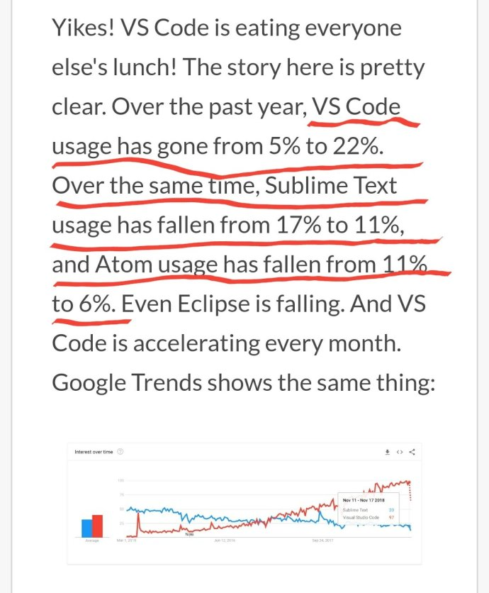

# 2018-12-07

## 1、VS Code 正在快速吃掉其他编辑器的市场份额，Sublime 和 Atom 是主要受害者。

[网页链接](http://t.cn/Ey0lY8g) ​​​​

## 2、Puppeteer 开始封装 Firefox

Puppeteer 现在不仅封装 Chrome，还开始封装 Firefox 了，API 完全一样。  
  
以后，浏览器自动化可能只用它就可以了，其他库都要被干掉了。[网页链接](http://t.cn/Ey0XQsm) ​​​​

## 3、edge变chromium？

在过去几年中，微软有意义地增加了对开源软件（OSS）社区的参与，成为世界上最大的OSS项目支持者之一。我们正在开始在桌面上开发Microsoft Edge时采用Chromium开源，成为其开源的更大贡献者和用户，这样我们就可以为我们的客户创建更好的Web兼容性，并减少Web的碎片化。所有网络开发者。[网页链接](http://t.cn/Eyp3WXI) ​​​​ ​​​​

## 4、张鑫旭大神写了一款在线svg压缩工具

 ​​​​应该是国内唯一免费且公开的SVG压缩合并工具。[网页链接](http://t.cn/RkIw11m) 

## 5、开发者系列，flutter issue 它来了

不过目前已关闭了。[网页链接](http://t.cn/EySLlKf) ​​​​

